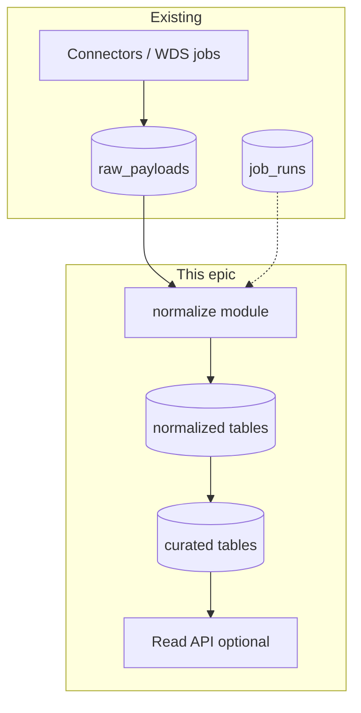

# Implementation plan: Normalization and curated layer (MVP)

**Spec**: [spec.md](./spec.md) | **Tasks**: [tasks.md](./tasks.md)

## Architecture (target increment)

- **Normalize**: pure-ish functions: `(raw_payload row) → validated DTO` then repository upsert.
- **Repositories**: new files under `apps/api/src/db/repositories/` (or `apps/api/src/normalization/` + repos) — follow existing patterns.
- **Jobs**: one named job (e.g. `statcan-wds-normalize`) or hook from existing runner — **decide in Phase 0** and record in spec open questions.

## Phases

### Phase 0 — Design lock (no migrations yet)

- Enumerate **in-scope** `raw_payloads.source` values and reference fixtures from `apps/api/test/`.
- Answer spec **open questions** (trigger model, error persistence).
- **Architect** updates [docs/architecture.md](../../architecture.md) with target-state data flow paragraph + link to [docs/data-model.md](../../data-model.md).
- Add **docs/data-model.md** (new) with MVP table list, PKs, FK to `raw_payloads`, and column semantics.

### Phase 1 — Schema

- SQLite migrations for normalized + curated tables (minimal columns; expand later).
- Types/Zod in `packages/types` for interchange and API responses if needed.

### Phase 2 — Normalization core

- Parser/validator per payload type; map to upsert DTOs.
- Repository upsert with idempotency constraint (unique index).

### Phase 3 — Orchestration

- Wire job runner or post-ingest hook; integration test with temp DB + fixture raw rows.

### Phase 4 — Read API (if in MVP)

- `GET` endpoint(s) under Hono; document query params; optional auth alignment with existing dashboard middleware.

### Phase 5 — Verification

- Update [verification.md](./verification.md) with `bun test`, migration apply smoke, and any manual checks.

## Risks

- **Schema churn**: start with **narrow** curated columns; additive migrations only.
- **Volume**: large JSON bodies — normalize in streaming-safe way or bound work per job batch.
- **SQLite locking**: same single-writer discipline as today.

## References

- [AGENTS.md](../../../AGENTS.md) — layered model, agent boundaries.
- [statcan-wds-automation plan](../statcan-wds-automation/plan.md)
