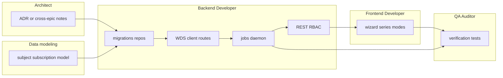

# Implementation plan: StatCan WDS operator UX

## Expected outcome (orchestrator)

By the end of this epic, **operators** can:

1. **Pick a catalog product**, **discover and confirm a series** using cube metadata (no raw coordinate paste required for the common path).
2. Set **cadence (UTC)** and an **`ingest_mode`** that matches their intent: rolling **latest N**, **incremental** driven by **global subject subscriptions** + WDS changed APIs, or **explicit backfill / full-table** (including **in-product CSV/SDMX**).
3. See **what ran** (mode, window, errors) in the existing ops console surfaces.

**Platform:** WDS coverage extends beyond today’s four methods in [`wds-routes.ts`](../../../apps/api/src/connectors/statcan/wds-routes.ts); **`statcan-scheduled-ingest`** (and/or companion jobs) implement the new modes; **SQLite** schema and repositories support `ingest_mode`, subscription tables, and optional backfill columns; **raw payloads** remain the system of record with **normalization deferred** but **data model** ready for v2.

---

## Agent ownership and sequencing

Work is ordered to avoid API/UI drift: **contracts and migrations first**, then **connector + jobs**, then **REST**, then **web**.

| Owner | Primary deliverables |
|-------|---------------------|
| **Architect** (light touch) | If watchlists/subjects touch [docs/architecture.md](../../architecture.md) or cross-app contracts, add a short ADR or architecture note; avoid silent schema drift. |
| **Data modeling / Backend** | Define **subject** key and **subscription** tables; **`ingest_mode`** enum and default; migration(s) after review. |
| **Backend Developer** | Extend `StatCanClient` + routes for: changed lists/data, bulk/range, series info; optional CSV/SDMX download path; fixture tests. |
| **Backend Developer** | Extend `statcan-scheduled-ingest` or add jobs (e.g. `statcan-changed-ingest`) for global subscription matching; throttle/retry. |
| **Backend Developer** | REST: series discovery & validation endpoints; schedule CRUD extensions; document OpenAPI or existing patterns. |
| **Frontend Developer** | Wizard: Product → Series → Cadence → Ingest options → Review; global subscription UI; plain-language copy for modes. |
| **QA Auditor** | Gate: typecheck, tests, manual spot checks per `verification.md`. |

**Out of bounds:** Frontend does not change `apps/api/**` without API contract agreement; Backend does not own Vue SFCs.

---

## Layout (expected touchpoints)

| Path | Role |
|------|------|
| [apps/api/src/connectors/statcan/wds-routes.ts](../../../apps/api/src/connectors/statcan/wds-routes.ts) | Add WDS method paths |
| [apps/api/src/connectors/statcan/statcan-client.ts](../../../apps/api/src/connectors/statcan/statcan-client.ts) | Client methods + Zod |
| [apps/api/src/jobs/statcan-scheduled.ts](../../../apps/api/src/jobs/statcan-scheduled.ts) | Mode branching / delegation |
| [apps/api/src/db/repositories/statcan-product-schedules.ts](../../../apps/api/src/db/repositories/statcan-product-schedules.ts) | Schedule fields |
| [apps/api/src/server/app.ts](../../../apps/api/src/server/app.ts) | New routes |
| [apps/web/](../../../apps/web/) | Schedule wizard + subscriptions |

---

## Phases

1. **Schema + contracts:** Migrations, `ingest_mode`, subscription/subject model, Zod types shared with API.
2. **WDS connector:** Implement changed-series/cube, bulk/range, series info; fixtures.
3. **Jobs:** Latest-N unchanged behavior; new paths for changed + backfill/full-table; job metadata for triage.
4. **REST:** Discovery + CRUD extensions; RBAC.
5. **Web:** Wizard steps + subscription management.
6. **Hardening:** Rate limits, idempotency review, `verification.md`.

---

## Risks

- **WDS availability windows** (409): UI/API must surface clear errors.
- **Global subscriptions** at scale: need indexing and bounded work per tick.
- **CSV/SDMX zip** size: streaming, disk limits, and checksum/idempotency keys.
- **Normalization epic:** keep raw lineage clean so v2 upserts are straightforward.
