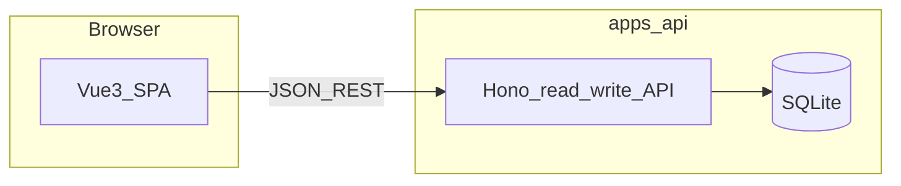

# Implementation plan: Web operations console (Vue)

## Architecture

- **SPA:** `apps/web` — Vite + Vue 3 + TypeScript; route-based layout; shared layout with nav by role.
- **API:** Extend [`apps/api/src/server/app.ts`](../../../apps/api/src/server/app.ts) only where list/search/detail is missing (catalog, raw payload by id, optional stats).
- **Auth v1:** Document deployment (VPN, reverse proxy) + minimal app gate; evolve to real API auth in a follow-up spec.

## Backend additions (minimal)

| Endpoint | Purpose |
|----------|---------|
| `GET /statcan/catalog` | Query params: `q`, `limit`, `offset` — search `statcan_cube_catalog` by `cube_title_en` / `cube_title_fr` / `product_id` |
| `GET /raw-payloads/:id` | Single row for JSON viewer |
| `GET /stats/summary` (optional) | Pre-computed job_run counts by status for window — avoids pulling 500 rows to client |

**Repositories:** New helpers in `apps/api/src/db/repositories/statcan-catalog.ts` (search) and `raw-payloads.ts` (`getById`).

**CORS:** Configure Hono `cors()` for dev Vite origin.

## Frontend layout (`apps/web`)

| Path | Role | Description |
|------|------|---------------|
| `/login` | all | Auth shell (per US-002) |
| `/dashboard` | all | KPIs + recent failures |
| `/schedules` | operator | Table |
| `/schedules/new` | operator | Wizard |
| `/schedules/:id` | operator | Detail + edit |
| `/jobs` | operator | Filterable list |
| `/jobs/:id` | operator | Detail |
| `/data` | operator | Payload list |
| `/data/:id` | operator | JSON viewer |

**Packages:** Reuse `@housing-insights/types` where job status enums overlap.

## Phases

1. **API gaps** — catalog list/search, raw payload by id, CORS; optional stats endpoint.
2. **Vue scaffold** — router, layout, API client, error toast pattern.
3. **Dashboard** — wire to job_runs + schedules endpoints (or stats).
4. **Schedules** — list/detail/PATCH/delete; then guided create wizard.
5. **Jobs + Data** — lists and details.
6. **RBAC polish** — viewer vs operator routes.
7. **Docs** — README runbook for `apps/web` + env vars.

## Risks

- **Large JSON bodies** — browser memory; mitigate truncation/warning.
- **Unauthenticated API** — deployment must restrict network access until auth ships.

## References

- PRD: [tasks/prd-web-ops-console.md](../../../tasks/prd-web-ops-console.md)
- Existing schedules API: [apps/api/src/server/app.ts](../../../apps/api/src/server/app.ts)
- Vue skill: [`.cursor/skills/vue/SKILL.md`](../../../.cursor/skills/vue/SKILL.md)
- Vue template to follow: ['.vue-admin-ref'](../../../.vue-admin-ref/)
